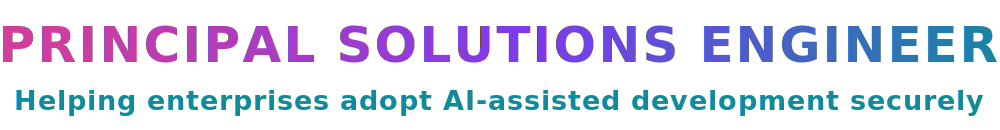

<div align="center">

<div>
 I'm Markus">
</div>

<picture>
  <source media="(prefers-color-scheme: dark)" srcset="images/title-banner.svg">
  
</picture>

<div>
<picture>
  <source media="(prefers-color-scheme: dark)" srcset="images/typing-focus.svg">
  
</picture>
</div>

🇬🇧 Brit builder · 📍 Lake Oswego, Oregon 🌲

<picture>
  <source media="(prefers-color-scheme: dark)" srcset="images/synthwave-divider.svg">
  
</picture>

### 🛠️ Featured Work

**🛡️ Security tooling for the agentic-AI era**

<a href="https://github.com/markusweldon/agentinel"></a>
<a href="https://github.com/markusweldon/snyk-ai-secure-pipeline"></a>

<a href="https://github.com/markusweldon/claude-owasp-security-skills"></a>
<a href="https://github.com/markusweldon/claude-snyk-security-expert"></a>

🚧 **Currently building** → [agentinel](https://github.com/markusweldon/agentinel): an OSS scanner that red-teams MCP servers & AI agents against the OWASP Agentic Top 10 (2026).

<div align="left">

**▶ Try the OWASP security skills**

```bash
curl -fsSL https://raw.githubusercontent.com/markusweldon/claude-owasp-security-skills/main/install.sh | bash
```

</div>

<picture>
  <source media="(prefers-color-scheme: dark)" srcset="images/synthwave-divider.svg">
  
</picture>

### 👨‍💻 About

<div align="left">

**Principal Solutions Engineer** working where AI meets Security. I help enterprises adopt Agentic AI-assisted software development without losing control of their risk posture, and I help build the tooling that makes it real: security scanners for MCP servers and AI agents, OWASP standards shipped as Claude Code skills, and end-to-end CI/CD pipelines that show what *"AI writes the code, security checks every line"* looks like in practice.

My focus is agentic AI in production: securing agent and MCP workflows, and designing the guardrails and safety directives that let teams ship *faster* with AI, not slower. Two decades in B2B solutions engineering taught me to optimize for the things that actually move enterprises: discovery that uncovers the real business problem, solutions that prove value in the customer's own context, and architecture that survives production.

</div>

<a href="https://markusweldon.com"></a>
<a href="https://linkedin.com/in/markusweldon"></a>
<a href="mailto:hello@markusweldon.com"></a>

<picture>
  <source media="(prefers-color-scheme: dark)" srcset="images/synthwave-divider.svg">
  
</picture>

### 🎯 Current Focus

**Securing agentic AI development end to end: the agent workflows, the MCP layer, and the code they ship.**


<picture>
  <source media="(prefers-color-scheme: dark)" srcset="images/synthwave-divider.svg">
  
</picture>

### 🧰 Stack

**AI & Security**


**Languages**


**Web & Runtime**


**Cloud & Infra**


<picture>
  <source media="(prefers-color-scheme: dark)" srcset="images/synthwave-divider.svg">
  
</picture>

### 💻 Workspace


 

<picture>
  <source media="(prefers-color-scheme: dark)" srcset="images/synthwave-divider.svg">
  
</picture>

### ⚡ Activity


<picture>
  <source media="(prefers-color-scheme: dark)" srcset="images/synthwave-divider.svg">
  
</picture>

### 🔥 Streaks & 🏆 Trophies


<div>

</div>

<picture>
  <source media="(prefers-color-scheme: dark)" srcset="images/synthwave-divider.svg">
  
</picture>

### 🕹️ Pac-Man Contribution Graph


</div>
