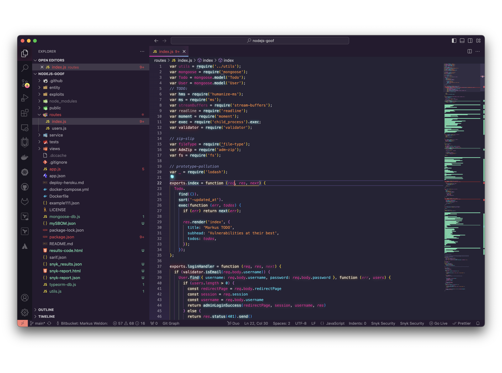
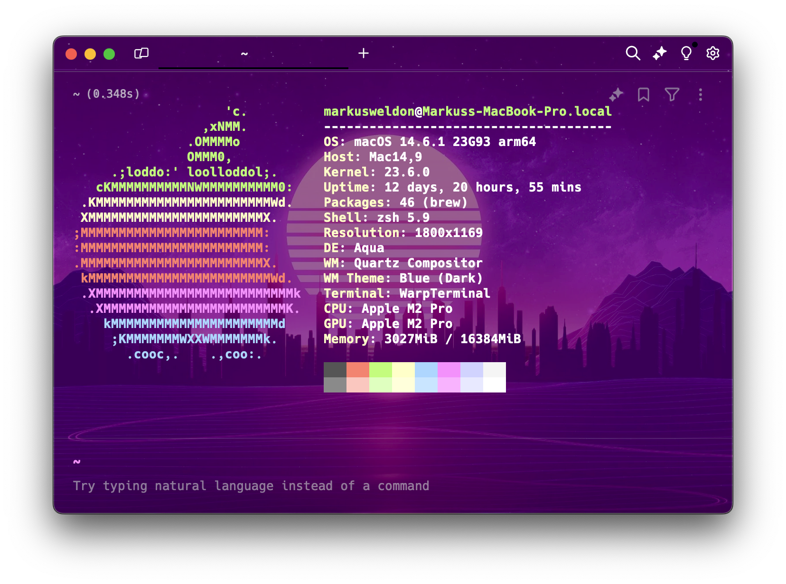

  

### < 👋 Hello World! />

I'm Markus, a 🇬🇧 Brit builder 📍 Based in Lake Oswego, Oregon 🌲 United States 🇺🇸

👨‍💻 Principal Solutions Engineer | 🛡️ AI Security Specialist | 🚀 20+ Years in Tech

🧠 Growth Mindset | 🎓 Business & Computer Science | 🤖 MCP & Agentic Security Workflows

Always learning new skills 💪🧠

### 🎯 Current Focus:

### 👨‍💻 About:

With over 20 years in the tech industry, I've developed deep domain expertise in B2B technical pre-sales and solution engineering. I excel in architecting and implementing value-driven software solutions that tackle complex business challenges and help drive sustainable business growth.

Currently specializing in AI-powered application security, agentic coding workflows, and MCP (Model Context Protocol) security context at Snyk — helping enterprises secure their AI development pipelines.

My personal North Star is focused on architecting scalable enterprise solutions that directly address impactful business challenges while ensuring they support future business growth. This ensures customers realize a greater return on investment.

### 🛠️ Tools and 🌎 Languages:

### Github Contribution Activity:

### 🔥 Github Streaks:

### 🏆 Github Trophies:

### 📊 GitHub Stats:

### 💻 Most Used Languages:

### 🏅 Achievements:

### 🌟 Notable Contributions:

### 📅 Contribution Calendar:

### ⚡ Recent Activity:

### 🔖 Starred Topics:

### 🏙️ GitHub Skyline 2025:

### 📬 Get in Touch:

💼 LinkedIn: [linkedin.com/in/markusweldon](https://linkedin.com/in/markusweldon)

📧 Personal Email: [hello@markusweldon.com](mailto:hello@markusweldon.com)

🖥️ ~~Personal Website: [markusweldon.com](https://markusweldon.com)~~ 🚧 Site currently under maintenance 👷‍♂️ Updating with Vercel and Next.JS

### 🎧 Current Listenings:

Apple Music + Marvis Pro App

### 💻 Workspace Setup:

Current IDE: VS Code w Theme: [SynthWave '84](https://marketplace.visualstudio.com/items?itemName=RobbOwen.synthwave-vscode)

Current CLI: Warp + NeoFetch, OhMyZsh, Brew

